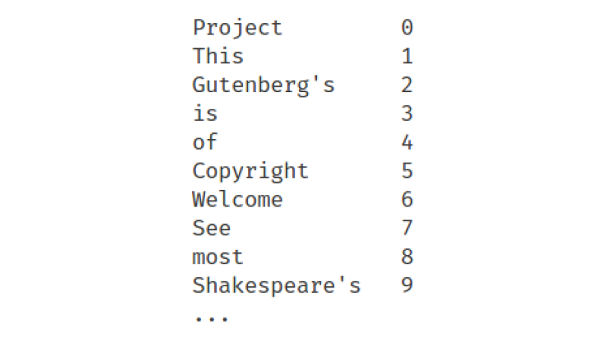

# Game of Thrones: Reverse Indexing

Castle Black's library is home to hundreds of thousands of rare and invaluable texts.

Our goal is to enable easier and more efficient search across documents based on keywords.

We will be using a vector representation of book documents called reverse indexing (a.k.a. inverted indexing).

# Table of Contents
1. [Motivation](README.md#Motivation)
2. [Dataset](README.md#Dataset)
3. [Methodology](README.md#Methodology)
4. [MapReduce](README.md#Architecture)
5. [Installation](README.md#Installation)

## Motivation

We are ultimately trying to generate a vector representation of documents, which is a common type of document representation used by search engines.
Vector representation enables use of mathematical tools such as distance, similarity and dimension reduction.

An inverted index of documents can significantly speed up calculations.
These calculations are often based on dot products that consume a lot of CPU and memory.
Having an inverted index greatly simplifies those dot products.

Here we aim to write an efficient implementation to build an inverted index of a large collection of documents.

## Dataset

Our dataset is a collection of N documents - think of each document simply as a book or text.

We have one file per document and the name of a file is simply the index of the document as shown below.

## Methodology

Bitcoin users can hold multiple addresses - creating a new address is straightforward, low-cost, and nearly instantaneous.
These addresses can then be used throughout a user's transaction history to accumulate and sell Bitcoin.

Assuming a forensics agent (i.e., FBI, CIA) gains access to a single address for a given individual under investigation, BitWatch can return all addresses (address cluster) likely to be associated with that user.

BitWatch exploits an innate property of Bitcoin transactions called the 'multi-input heuristic' to perform address clustering.
For example, let's say you walk into your favorite coffee shop and buy a rather expensive latte for $5.36 USD. You take a five dollar bill, quarter, dime, and penny out of your wallet / coin purse.
In this case we know that all those bills and coins, the 'transaction inputs', came from the same individual - you.
This heuristic can be applied to Bitcoin transactions - all input transactions (UTXOs) are likely to come from the same individual.

Disclaimer: this heuristic does not hold for CoinJoin transactions where groups of individuals can collude and mix inputs into a given transaction.
However, not all Bitcoin wallets support the CoinJoin feature and most users do not commonly use CoinJoin.
In addition, algorithms exist to detect CoinJoin transactions, which may be implemented in a future release.

Fun side note: the privacy implications of the 'multi-input heuristic' have a far-reaching history.
This property was mentioned in the original [Bitcoin whitepaper](https://bitcoin.org/bitcoin.pdf) in Section 10 by Satoshi Nakamoto, the founder of Bitcoin.

Once we have the set of addresses at the individual transaction level, we can apply the classic Disjoint Set (a.k.a. Union Find) graph algorithm to generate address clusters that likely belong to the same individual / entity.
Extending the coffee transaction example from before, we have a set of 4 unique input addresses associated with the coffee transaction.

Now add another transaction called the dinner transaction, which has 2 unique input addresses.
In the diagram below, we can see that address #2 (blue) is present in both the coffee set and the dinner set.
Therefore, we can assume that the same individual holds all five unique addresses.

Applying the Disjoint Set algorithm using a relational style model is not efficient as it requires many self joins.
Instead, we use a graph model with vertices representing unique address IDs and edges representing connections between addresses at the individual transaction level.
We leverage the [connectedComponents()](https://docs.databricks.com/spark/latest/graph-analysis/graphframes/user-guide-scala.html#connected-components) method in Spark Graphframes as an efficient implementation of Disjoint Set.

## MapReduce

### Data Acquisition

Data is acquired by running JSON-RPC calls from a full Bitcoin Core node.

Run `./json-rpc-pase-all-blocks.sh` in `/src/bash` directory to deserialize Bitcoin block data into JSON and write into dedicated AWS S3 bucket.
This must be run from a full Bitcoin Core node with transaction indexing enabled (see [here](https://www.buildblockchain.tech/blog/btc-node-developers-guide) for setup instructions)

### Ingestion

BitWatch runs on top of a Spark cluster (one c5.large for master, three c5.2xlarge for workers) and a single PostgreSQL instance (one m4.large).

Data is ingested with Spark from an S3 bucket that holds JSON files (one file for each blockchain block).

Results are then written out to PostgreSQL in a tabular format in a `transactions` table (each row represents one transaction).

(See Installation section below) Run `process-json.py` in `src/spark` directory using `spark-submit` command in PySpark to ingest JSON files from AWS S3 bucket.

### Compute

BitWatch uses Spark GraphFrames (built on top of a vertex DataFrame and edge DataFrame) to run `.connectedComponents()` method for generating address clusters.

`.connectedComponents()` is an implementation of the Disjoint Set (a.k.a. Union Find) algorithm to cluster addresses across Bitcoin transactions.

Using a graph model for processing transaction data is crucial as Disjoint Set on a relational model is much slower compared to a graph model.

(See Installation section below) run `tx-lookup-cluster.py` in `src/spark` directory using `spark-submit` command in PySpark to process `transactions` table in PostgreSQL and generate address clusters.

## Installation

Spark installation will occur on local machine, but installation instructions are equally applicable to an AWS EC2 cluster.

Before going through the below instructions, please familiarize yourself with setting up security groups in AWS [here](https://docs.aws.amazon.com/vpc/latest/userguide/VPC_SecurityGroups.html).

### Spark

We will set up Spark on a local machine for testing purposes, but below instructions are applicable to a full AWS EC2 cluster (master + workers).

When installing only on local machine, ignore any worker-specific instructions below.

We will launch four EC2 instances, each using the **Ubuntu Server 18.04 LTS (HVM), SSD Volume Type** 1 x m5.large (master), 3x m5.2xlarge (workers) image type and set root volume storage to 100 GB.
Then [SSH into the instance](https://docs.aws.amazon.com/AWSEC2/latest/UserGuide/AccessingInstancesLinux.html) and run the following commands:

    # run update and install java and scala
	sudo apt update
	sudo apt install openjdk-8-jre -y
	sudo apt install scala -y
	
	# install sbt
    echo "deb https://dl.bintray.com/sbt/debian /" | sudo tee -a /etc/apt/sources.list.d/sbt.list
    sudo apt-key adv --keyserver hkp://keyserver.ubuntu.com:80 --recv 2EE0EA64E40A89B84B2DF73499E82A75642AC823
    sudo apt-get update
    sudo apt-get install sbt
    
    # install Spark 2.4.3
    wget http://apache.mirrors.tds.net/spark/spark-2.4.3/spark-2.4.3-bin-hadoop2.7.tgz -P ~/Downloads
    sudo tar zxvf ~/Downloads/spark-2.4.3-bin-hadoop2.7.tgz -C /usr/local
    sudo mv /usr/local/spark-2.4.3-bin-hadoop2.7 /usr/local/spark
    sudo chown -R ubuntu /usr/local/spark
    
    # edit ~/.profile
    nano ~/.profile
    
    # add in following lines to ~/.profile
    export SPARK_HOME=/usr/local/spark
    export PATH=$PATH:$SPARK_HOME/bin
    export PYSPARK_PYTHON=python3
    
    # update environment variables
    source ~/.profile
    
    # configure Spark
    cp /usr/local/spark/conf/spark-env.sh.template /usr/local/spark/conf/spark-env.sh
    
    # edit spark-env.sh
    nano /usr/local/spark/conf/spark-env.sh
    
    # add in following lines to spark-env.sh
    export JAVA_HOME=/usr/lib/jvm/java-8-openjdk-amd64
    export SPARK_PUBLIC_DNS="<MASTER-public-dns>" (i.e., like ec2-x-xx-xxxx-xx.compute1.amazonaws.com)

Go to master node and run:

    touch $SPARK_HOME/conf/slaves
    
Add each worker to the file by opening $SPARK_HOME/conf/slaves and copying the public DNS (one per line):

    nano $SPARK_HOME/conf/slaves
    
Connect master node to worker nodes (commands are only for master node):

    sudo apt install openssh-server openssh-client
    cd ~/.ssh
    ssh-keygen -t rsa -P ""
    
    Generating public/private rsa key pair.
    Enter file in which to save the key: id_rsa
    Your identification has been saved in id_rsa.
    Your public key has been saved in id_rsa.pub.
    
Manually copy id_rsa.pub key top worker nodes:

    # on master:
    cat ~/.ssh/id_rsa.pub
    
    # on slaves:
    vi ~/.ssh/authorized_keys
    # paste the key
    
    # test connection from master to workers
    ssh ubuntu@ec2.x--x-x-x-x-x
    
Start Spark server (should see Spark ASCII art):

    # start Spark server
    sh /usr/local/spark/sbin/start-all.sh
    
Check everything is working by going to the master_public_ip:8080 (requires port 8080 open).
If you see the SparkUI with your workers up, Spark setup is complete.

Install PySpark:

    # install pip3
    sudo apt install python3-pip -y
    
    # install pyspark and findspark
    pip3 install pyspark
    pip3 install findspark --user
    
We should now be able to submit PySpark scripts (i.e., `reverse-index.py`) files using `spark-submit` and run in Spark.

